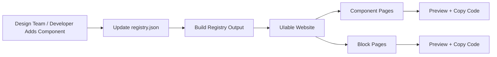

# UIable Project Architecture

This document explains the architecture of the UIable component and block repository for both non-technical and technical readers.

## 1) For Non-Technical Readers

UIable is a catalog website plus a code registry:
- It shows reusable UI components and larger page blocks.
- Each example you see on the site maps to real source files in the repo.
- The catalog is generated from a central registry file so content stays consistent.

### Simple Diagram (Non-Technical)



## 2) For Technical Readers

### High-Level Modules

- `app/**`: Next.js App Router routes and layouts.
- `components/ui/**`: shared primitives (shadcn-based core components).
- `components/uiable/**`: variant implementations and blocks shown in catalog.
- `registry.json`: source of truth for catalog items and their file mappings.
- `public/r/**`: generated registry output used for distribution/export.
- `config/**`: navigation structure, descriptions, and derived counts.

### Technical Architecture Diagram

```mermaid
flowchart TD
  subgraph Runtime[Next.js Runtime]
    R1[app/(component)/components]
    R2[app/(component)/[category]]
    R3[app/blocks]
    R4[app/blocks/[category]]
  end

  subgraph DataSources[Content + Metadata]
    D1[registry.json]
    D2[config/components.ts]
    D3[config/category-info/*]
    D4[config/category-counts.json]
  end

  subgraph SourceCode[Code Assets]
    S1[components/ui/*]
    S2[components/uiable/*]
    S3[components/uiable/blocks/*]
    S4[assets/svg/*]
  end

  subgraph BuildPipeline[Build/Generation]
    B1[npm run registry:build]
    B2[public/r/* generated files]
    B3[scripts/generate-counts.js]
  end

  D1 --> R2
  D1 --> R4
  D2 --> R1
  D2 --> R3
  D3 --> R2
  D3 --> R4
  D4 --> R1
  D4 --> R3

  R2 --> S2
  R4 --> S3
  R1 --> S4
  S2 --> S1
  S3 --> S1

  D1 --> B1 --> B2
  D1 --> B3 --> D4
```

## 3) Request/Render Flow

1. User opens category route (`/{category}` or `/blocks/{category}`).
2. Server route reads `registry.json`.
3. It filters items by category and reads source file content.
4. Client view dynamically imports component/block source from `components/uiable/**`.
5. UI renders live preview plus code view/copy actions.

## 4) Current Directory Layout (Practical View)

```text
app/
  (component)/...
  (dashboard)/...
  blocks/...
  auth/...
components/
  ui/               # shared primitives
  uiable/          # component variants + blocks
  layout/
config/
  components.ts
  category-info/
  category-counts.json
public/
  r/                # generated registry output
registry.json       # source registry
scripts/
  generate-counts.js
```

## 5) Source of Truth Guidance

- Primary source for catalog entries: `registry.json`.
- Primary source for nav grouping: `config/components.ts`.
- Primary source for long-form category copy: `config/category-info/*`.
- Generated artifacts:
  - `public/r/**` from registry build.
  - `config/category-counts.json` from `scripts/generate-counts.js`.
